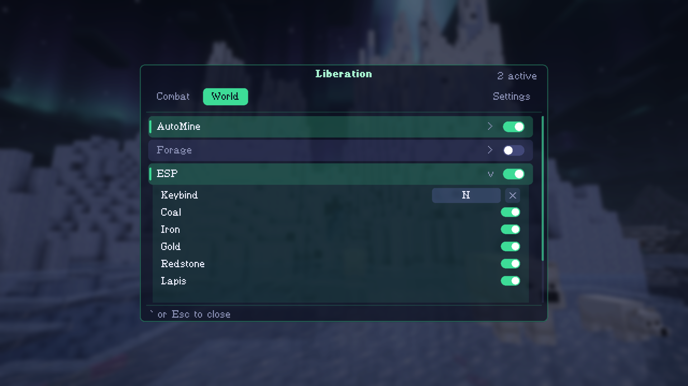

# Liberation

A client mod for Minecraft single player. Mine ores, fight mobs and see through walls, all from one menu you can restyle.

Fabric, Minecraft 26.3. Made for playing with friends on your own worlds.

**Live website: [liberation-official.github.io](https://liberation-official.github.io)**

## Screenshots

## What it does

- **AutoMine**: Walks to the ores you pick, aims like a person and mines them. Coal, iron, gold, redstone, lapis, diamond and emerald.
- **Kill**: Attacks the mobs you choose in range, with a natural click rate and smooth aiming.
- **ESP**: Outlines ores through walls so you can see where to dig.
- **Hitbox**: Draws a box around every mob nearby, through walls.
- **Menu**: Tabs for Combat and World, a live list of what is switched on, and a Settings tab for accent color and font.

## Install it

1. Install [Fabric Loader](https://fabricmc.net/use/installer/) for Minecraft 26.3.
2. Download [Fabric API](https://modrinth.com/mod/fabric-api) and the Liberation jar from the [latest release](https://github.com/Liberation-Official/Liberation-Official.github.io/releases/latest).
3. Put both jars in your `mods` folder and start the game.
4. Open a single player world and press `` ` `` to open the menu.

## Keys

| Action          | Key |
| --------------- | --- |
| Open the menu   | `` ` `` |
| AutoMine        | `M` |
| Kill            | `K` |
| Hitbox          | `B` |
| ESP             | `N` |

Every key can be changed from the menu.

## Single player only

Most multiplayer servers ban this kind of mod, so keep it to your own worlds.

---

Liberation is not affiliated with Mojang or Microsoft.
