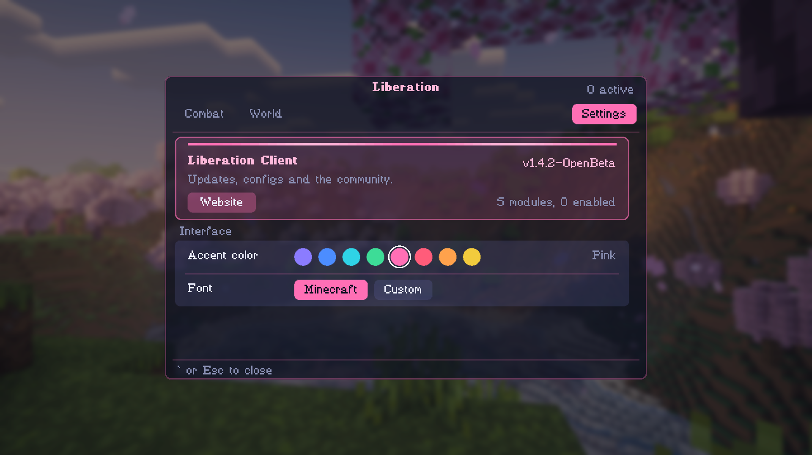

# Liberation

The website for Liberation Client, a Fabric client mod for Minecraft 26.3 single player.

Live at https://liberation-official.github.io/

## What's here
- `index.html`: the page content.
- `script.js`: the color swatches and the background fade.
- `style.css`: all the styling (colors, background, glass panels).
- `assets/`: the menu screenshots (menu.png, menu2.png), background.png and background2.png and the Padauk font used on the page.

## Download
Grab the latest jar from [Releases](../../releases/latest), then follow the install steps on the site.

## Single player only
Most multiplayer servers ban mods like this. Keep it to your own worlds.
